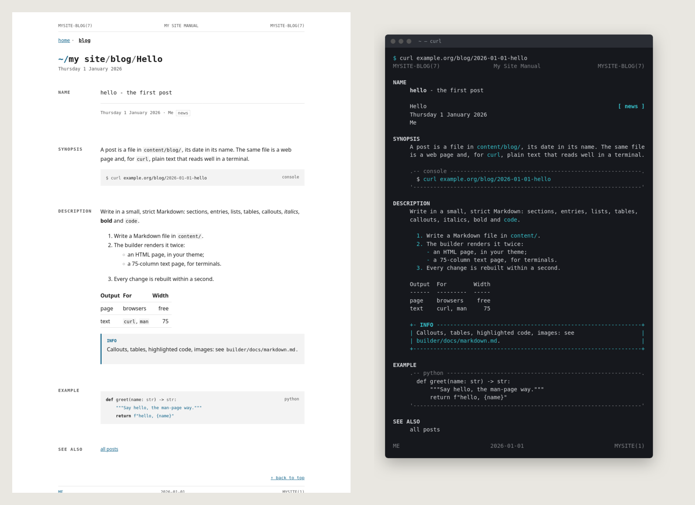
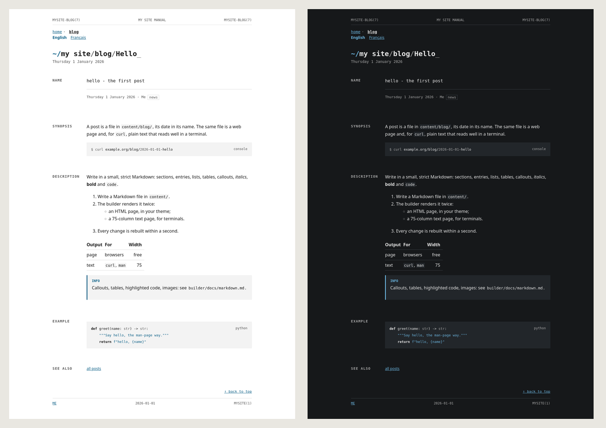
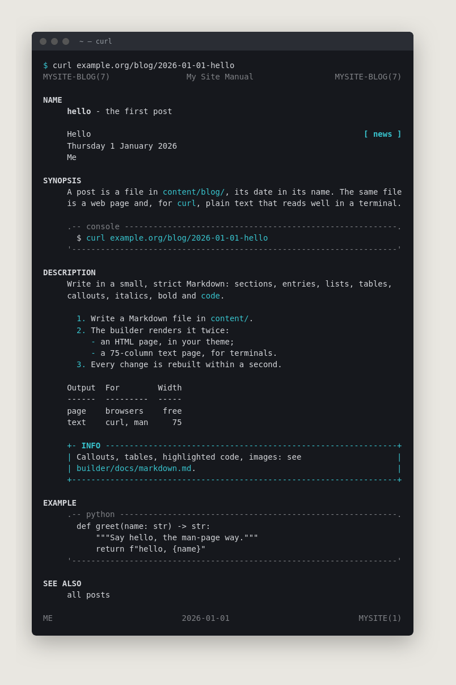

# tilder - a man-page site builder

**tilder** is a static site generator for websites that read like a man
page. Markdown in, two outputs out: HTML for browsers, and plain ASCII for
terminals (`curl example.org`). Python standard library only; one optional
tool, `rsvg-convert`, to draw the icons and the link preview.

It knows nothing of any particular site: every name, word and value comes
from the project's `content/site.toml`. Copy this `builder/` folder into
your project, or keep it as a git submodule.



*One Markdown file, `starter/content/blog/2026-01-01-hello.md`, in the
starter's minimal theme: the page, and what `curl` gets - 75 columns,
coloured, code framed, tables aligned.*

---

## What it gives you

- Pages from `content/*.md`, in a small Markdown dialect with man-page
  sections, entries, callouts, tables, task lists, highlighted code
  (`docs/markdown.md`).
- A text mirror of every page, 75 columns, plain and ANSI-coloured, for
  terminals and braille displays.
- Collections of content, declared in `site.toml`, each of a **type** -
  posts, events, members, or a type your theme adds in ten lines of Python
  (`docs/types.md`) - with their lists, RSS feeds and iCalendar feeds.
- SEO: one `<h1>` per page, canonical URLs, Open Graph and Twitter Card,
  JSON-LD structured data, `sitemap.xml`, `robots.txt`, build-time checks
  (`docs/seo.md`).
- Accessibility in the markup: one `<h1>`, landmarks, alt text, labels,
  named regions, links announced when they open a tab.
- Icons (`favicon.ico`, PNGs) and a 1200x630 share image, drawn at every
  build from your `assets/logo.svg`. Nothing generated is committed.
- A watch mode that rebuilds on every change, and at midnight.

## Layout of a project

```
my-site/
  content/
    site.toml         your settings and words (see defaults.toml)
    index.md          the landing page
    404.md
    blog/             optional: YYYY-MM-DD-slug.md, or YYYY-MM-DD-slug/index.md with images
    events/           optional, the same way
    members/          optional: one <slug>.md per member
  theme/              how it looks: layout.html (required), style.css,
                      scripts, fonts, icons, share.svg,
                      layouts/, types/, theme.toml (docs/theme.md)
  assets/
    logo.svg          the source of every icon and of the share image
    ...               anything else is served as-is
  builder/            this folder
```

Start from the starter site:

```sh
cp -r builder/starter/* my-site/     # content/ and assets/
cd my-site
python3 builder/build.py             # -> public/
```

## Running it

```sh
python3 builder/build.py                    # build once into public/
python3 builder/build.py --watch            # rebuild on every change
python3 builder/build.py --root DIR         # build another project
python3 builder/build.py --out DIR          # write somewhere else
```

`--root` defaults to the current directory when it has a `content/` folder,
else to the folder that holds `builder/`.

With Docker, `builder/Dockerfile` is Python plus `rsvg-convert` and
`woff2_decompress`: the share image then uses the theme's own fonts.
Without them, the build falls back to ImageMagick, or skips the images
with a warning. The image is also published by CI at
`ghcr.io/thosted/tilder` (`latest`, and one tag per release): with it a
site needs no submodule - see `examples/compose.yaml`.

To serve the result, any static server works. `examples/Caddyfile` gives
the whole contract, for Caddy: clean URLs, the text mirror served to `curl`
directly, a plain-text host, the CSP (same-origin scripts only), caching
and compression. Copy it next to your compose file and set the hosts
through the environment.

## Configuration

`content/site.toml` is merged over `builder/defaults.toml`, which lists
every key with a comment: the site's name and URL, the man-page header and
footer, the navigation, every label a reader sees (in your language), feed
and calendar texts, how dates are written, SEO limits, colours of the share
image, member categories. The builder holds no user-facing text.

Three layers: `builder/defaults.toml`, then the theme's `theme.toml` if it
has one, then `content/site.toml`. A type's own words default from its
module.

## Themes




The builder ships no theme: it writes semantic HTML with stable class
names, and the site's `theme/` folder decides how it looks.
`docs/theme.md` is the contract - the files a theme may provide, the
placeholders of `layout.html`, every class the builder writes.
`starter/theme/` is a minimal theme covering all of it, on system fonts:
copy it and make it yours. Scripts (the member search, the copy button),
web fonts, profile logos and the share-image template are optional theme
files; without them the build goes on and simply leaves them out.

## The code

The code is in `src/`, one concern per module; the map is at the top of
`src/build.py`. Everything is
the standard library. `docs/markdown.md` is the format; keep it in step
with `markdown.py`, `page.py` and `text.py`, since every construct is
rendered twice.

`tests/`: `python3 -m unittest discover -s tests -t .` builds a fixture
site and checks it.

## Why 75 columns



The text mirror targets an 80-column terminal, the default since the VT100
and still what `man` assumes. The 5 spare columns absorb a scrollbar, a
`less` or diff gutter, or an email quote (`> `) without wrapping. The
derivation runs one way: the source keeps its accents and links, the text
folds them.

## Contributing

`AGENTS.md` holds the rules - for agents and humans alike.

## Licence

MIT (`LICENSE`). The starter's example content and theme are under the same
licence: copy them, change them, ship them.
